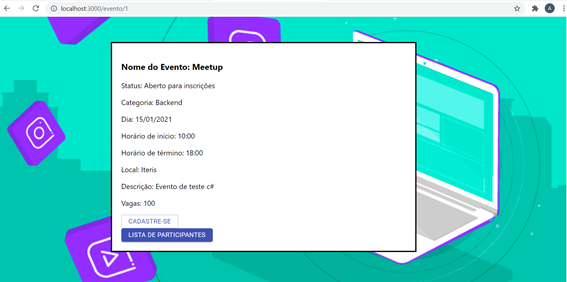

# Plataforma de eventos
<h2>Projeto criado com banco de dados SQL, back em C# e front em React.</h2>

<h3>É possível consultar os eventos cadastrados no banco:</h3>

<h1 align="center">
  
  
  </h1>
  
<h3>  A consulta pode ser filtrada por categoria:</h3>
 
 <h1 align="center">

</h1>

<h3> Selecionando a opção "Saiba Mais" é possível visualizar mais informações sobre o evento:</h3>
 
 <h1 align="center">

</h1>

<h3>  E realizar a insrição:</h3>

Os dados do participante são salvos no banco de dados e é possível retirar a lista de participantes por evento

 
 <h1 align="center">

</h1>

Também existe a tela de cadastro de novo evento que registra em banco e outras regras de negócio.
